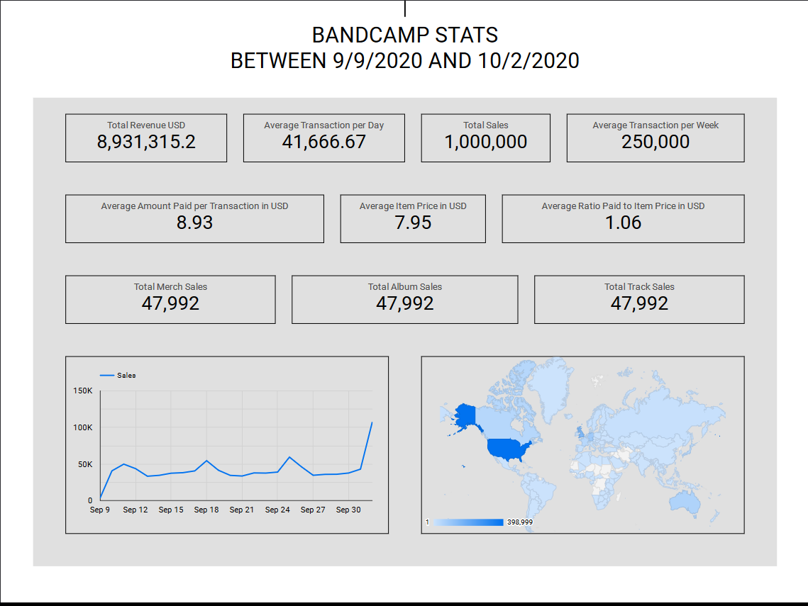
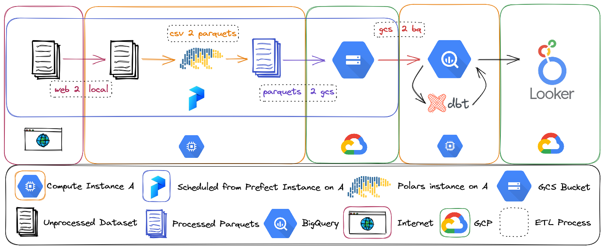

# Data Engineering Zoomcamp Capstone Project 
This project leverages [Component's dataset](https://components.one/datasets/bandcamp-sales) containing [Bandcamp](https://bandcamp.com/) transactions from September 9, 2020 to October 2, 2020, to gain insights into sales and evaluate the effectiveness of Bandcamp's business model. The insights obtained from this project are similar to those presented in Component's report, [The Chaos Bazaar](https://components.one/posts/bandcamp-the-chaos-bazaar). While the Component's report already provides better insights than this project, the project owner undertakes it to hone their data engineering skills, including pipeline orchestration, DBT ETL, terraform, and other related techniques.

## Technology Stacks
- [Terraform](https://www.terraform.io/) for IaC
- [Prefect](https://www.prefect.io/) for pipeline orchestration
- [Polars](https://www.pola.rs/) for ETL
- [BigQuery](https://cloud.google.com/bigquery) for data warehouse  
- [DBT](https://www.getdbt.com/) for ELT
- [Looker Studio](https://lookerstudio.google.com/navigation/reporting) for reporting and visualization

## [Dashboard](https://lookerstudio.google.com/reporting/e1170d06-3785-4092-ae2d-483773b95acc)

## Technical Summary
### Bird's eye view of the project

### DBT Flow

### Schema of final Fact Table used for visualization
- _id: Unique identifier combining the sale's URL and UTC timestamp
- transaction_date: Transaction datetime
- url: The path to the item on Bandcamp
- artist_name: Name of the artist
- album_title: Title of the album, if applicable
- item_type: Denotes the type of object transacted whether if its an physical album, digital album, or digital track
- slug_type: Denotes the type of object transacted whether if its n album, track, or merch
- country: Country of the buyer
- item_price: Item price set by the seller in seller's currency
- amount_paid: Amount of money paid in seller's currency
- currency: Currency used by the seller
- item_price_usd: Item price converted to dollar
- amount_paid_usd: Amount paid converted to dollar
- amount_overpaid_usd: Amount voluntarily paid by the buyer in dollar
- paid_to_price_ratio: Ratio of amount paid to item price
