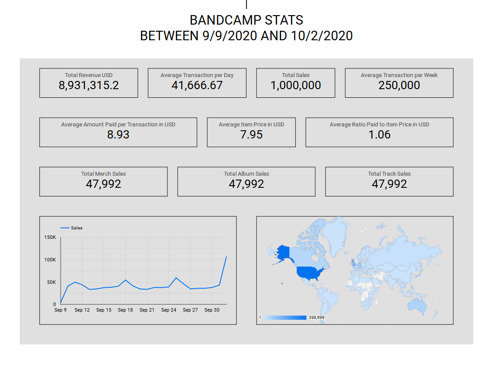
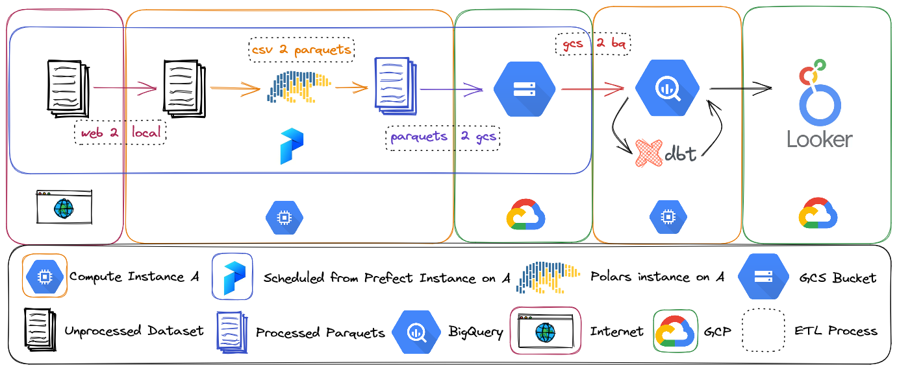
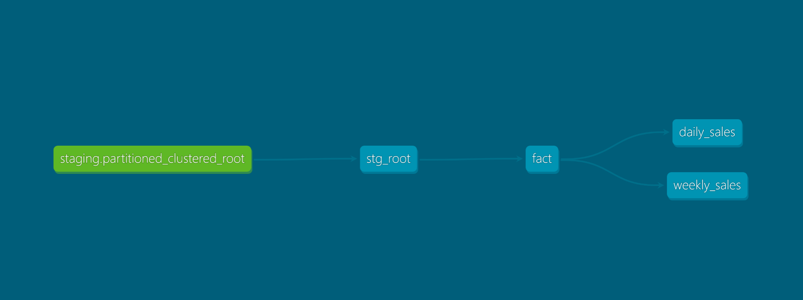

# Data Engineering Zoomcamp Capstone Project 
This project leverages [Component's dataset](https://components.one/datasets/bandcamp-sales) containing [Bandcamp](https://bandcamp.com/) transactions from September 9, 2020 to October 2, 2020, to gain insights into sales and evaluate the effectiveness of Bandcamp's business model. The insights obtained from this project are similar to those presented in Component's report, [The Chaos Bazaar](https://components.one/posts/bandcamp-the-chaos-bazaar). While the Component's report might provides better insights than this project, the project owner undertakes it to hone their data engineering skills, including pipeline orchestration, DBT ELT, terraform, and other related techniques.

Now that are explained, I would also like to express my appreciation to [DataTalks.Club](datatalks.club) for providing me with the opportunity to learn data engineering in a structured and effective way, as well as for offering various chances to practice and improve my skills. Thanks to their resources and support, I have been able to learn and test my abilities in docker, pipeline orchestration, apache spark for batch processing, DBT for ELT, kafka for stream processing, and related techniques.

## Technology Stacks
- [Terraform](https://www.terraform.io/) for IaC
- [Prefect](https://www.prefect.io/) for pipeline orchestration
- [Polars](https://www.pola.rs/) for batch processing
- [BigQuery](https://cloud.google.com/bigquery) for data warehouse  
- [DBT](https://www.getdbt.com/) for ELT
- [Looker Studio](https://lookerstudio.google.com/navigation/reporting) for reporting and visualization

## [Dashboard](https://lookerstudio.google.com/reporting/e1170d06-3785-4092-ae2d-483773b95acc)

## Technical Summary
### Bird's eye view of the project

### DBT Flow

### Schema of final Fact Table used for visualization
- `_id`: Unique identifier combining the sale's URL and UTC timestamp
- `transaction_date`: Transaction datetime
- `url`: The path to the item on Bandcamp
- `artist_name`: Name of the artist
- `album_title`: Title of the album, if applicable
- `item_type`: Denotes the type of object transacted whether if its an physical album, digital album, or digital track
- `slug_type`: Denotes the type of object transacted whether if its n album, track, or merch
- `country`: Country of the buyer
- `item_price`: Item price set by the seller in seller's currency
- `amount_paid`: Amount of money paid in seller's currency
- `currency`: Currency used by the seller
- `item_price_usd`: Item price converted to dollar
- `amount_paid_usd`: Amount paid converted to dollar
- `amount_overpaid_usd`: Amount voluntarily paid by the buyer in dollar
- `paid_to_price_ratio`: Ratio of amount paid to item price

## Running
To ensure that the project runs smoothly, you should have the following prerequisites in place:
- A [GCP Account](https://cloud.google.com/)
- A GCP Service Account file with owner rights.

To set up the project, perform these steps:
1. Clone the repository and place the service account file in the `config/` folder as `.secret.json`.
2. Prepare your GCP infrastructure:
   - You can manually create a GCS bucket and a BQ dataset named `bandcamp`.
   - Alternatively, you can use Terraform:
      - Navigate to the `terraform/` directory using `cd`.
      - Modify the configuration in `terraform/variables.tf`.
      - Execute `terraform init`, then `terraform plan`, and review the plan. Finally, execute `terraform apply`.
3. Set up a virtual environment using either virtualenv or Anaconda. Install all dependencies listed in `requirements.txt`, and activate the environment.
4. To use Prefect for orchestration, do the following:
   - Navigate to the `orchest/` directory using `cd`, and install the flows by running `pip install -e .` in the virtual environment.
   - Create two Prefect blocks in Orion: GCP Credentials that point to the service account file, and Local File System that point to the local data folder where data files are located.
   - Modify the constant variables in `flows/web_2_local_2_gcs.py` and `flows/gcs_2_bq.py` as needed.
   - Deploy all flows by running the following commands:
     - `prefect deployment build -a flows/web_2_local_2_gcs.py:main --name web_2_gcs`
     - `prefect deployment build -a flows/gcs_2_bq.py:main --name gcs_2_bq`
   - Run a Prefect agent, then execute the `web_2_gcs` and `gcs_2_bq` flows in order, either from Prefect Orion or from the command line.
5. To use DBT for ELT, do the following:
   - Modify `~/.dbt/profiles` using the GCP service account file, based on the instructions in the [DBT BigQuery Setup](https://docs.getdbt.com/reference/warehouse-setups/bigquery-setup#service-account-file) section of the documentation.
   - Execute `dbt run` in the `dbt/` directory.
   - To generate documentation, execute `dbt docs generate`, then `dbt docs serve`.
6. To visualize the data using Looker Studio Visualization, follow these steps:
   - Open Looker Studio using the same account where your BigQuery is located.
   - Connect the data and create visualizations.
7. You're done!

## Note for DataTalksClub evaluators
- The process of which columns are partitioned and clustered can be seen on `orchest/flows/gcs_2_bq.py` with it's reasoning and explanation

## Todo
- Prefect
   - One script to deploy all flows instead of using CLI.
   - Find a way to to put hard coded constants somewhere else, maybe in prefect blocks.
   - Find a way to utilize DaskTaskRunner with polars for blazingly fast ETL.
- DBT
   - Proper docs.
   - Add tests.
- Looker Studio
   - Utilize tables derived from the fact table.
